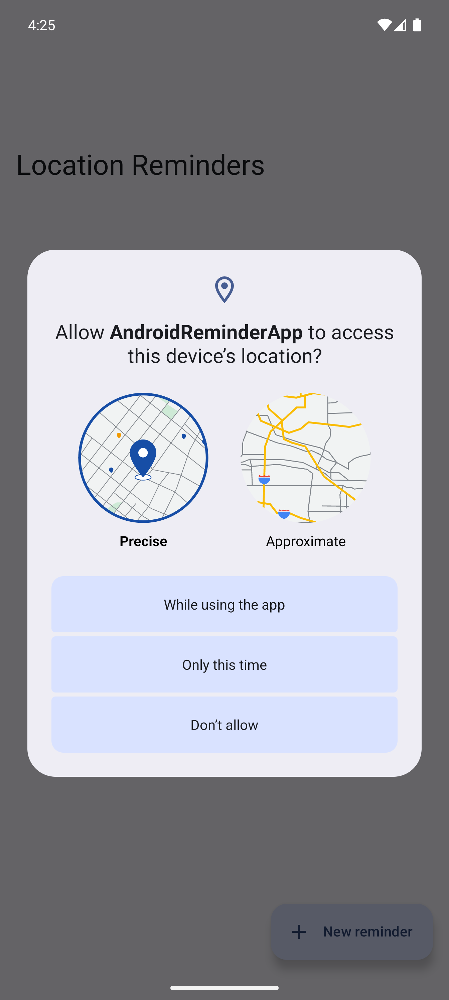
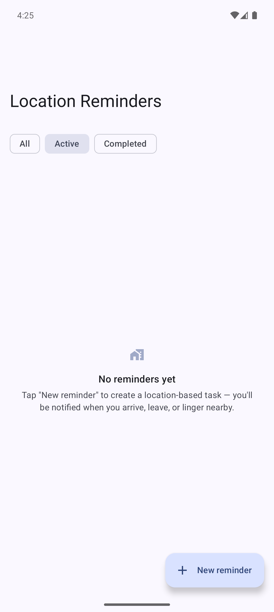
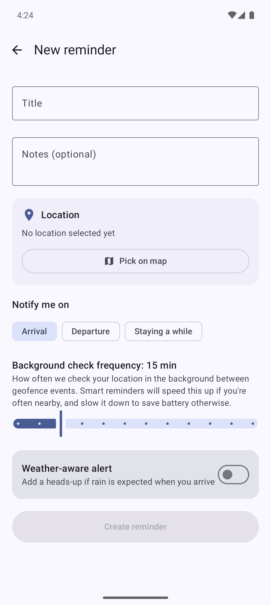
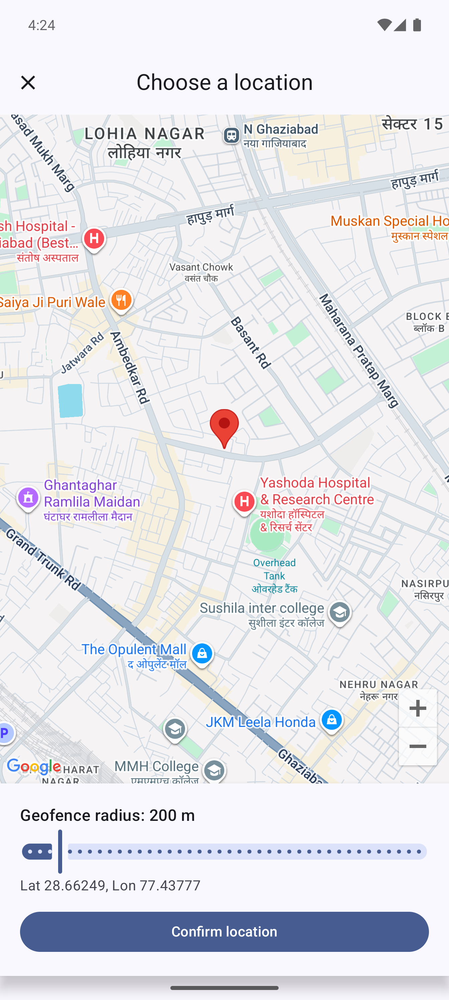
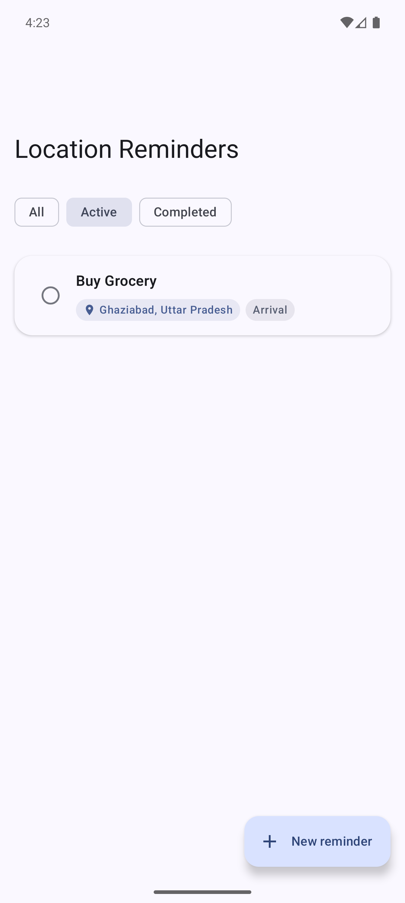
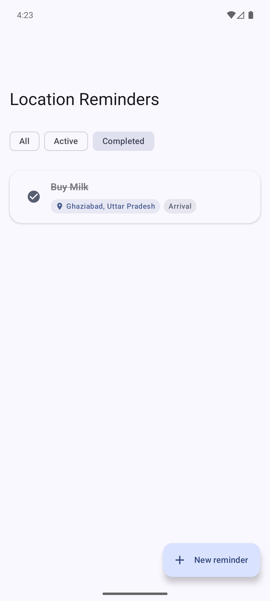
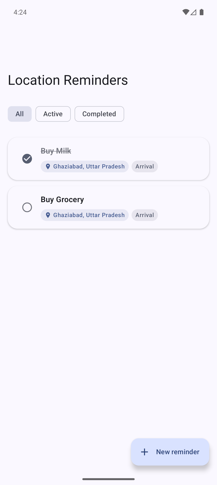

# Android Location Reminder App

A location-based reminder app built with **MVVM + Clean Architecture**, **Jetpack Compose**,
**Room**, **Retrofit**, **Coroutines/Flow**, **WorkManager**, and the platform **Geofencing API**.

## ⚠️ First-time setup (do this before opening the project)

1. **Open in Android Studio **. It will auto-generate the Gradle wrapper jar/
   `gradlew` script on first sync — they're intentionally omitted from this bundle since they're
   large binaries. If you'd rather do it from the command line first, run `gradle wrapper
   --gradle-version 9.4.1` once (requires a local Gradle install) before opening the project.
2. **Google Maps API key** (needed for the map picker screen):
   - Get a free key at https://console.cloud.google.com/google/maps-apis (enable "Maps SDK for Android").
   - Replace `YOUR_GOOGLE_MAPS_API_KEY_HERE` in `app/src/main/AndroidManifest.xml`.
3. **No key needed for weather or geocoding** — both use free, keyless public APIs
   ([Open-Meteo](https://open-meteo.com) and [OSM Nominatim](https://nominatim.org)).
4. Run on a device/emulator with Google Play Services (geofencing requires it) and API 24 or above.

---

## 📸 Screenshots & Demo

### Screens








### Location Reminder App Demo Video


## Architecture

```
presentation/   Compose UI + ViewModels (tasklist, addtask, mappicker)
domain/         Pure Kotlin: Task/Weather models, TaskRepository interface, use cases
data/           Room (local, offline-first) + Retrofit (weather, geocoding) + repository impl
location/       FusedLocationProviderClient wrapper, Geofencing, WorkManager periodic worker
notification/   Single notification channel, per-task notification IDs
di/             Hilt modules (Database, Network, Repository)
```

Dependency direction is strictly `presentation → domain ← data`; the domain layer has zero
Android/Room/Retrofit imports, so ViewModels and use cases are unit-testable without a device
or emulator (see `app/src/test`).

## How the two location mechanisms fit together

- **Geofencing (`GeofenceHelper` + `GeofenceBroadcastReceiver`)** — the platform's low-power
  geofence monitoring wakes the app instantly on enter/exit/dwell, even if the app isn't running.
  This is the primary, battery-cheap trigger.
- **`LocationCheckWorker` (WorkManager, every 15 min)** — a fallback/complement that takes a
  single balanced-power location fix and re-evaluates all active tasks. It also runs the
  **smart-reminder frequency logic** (`EvaluateSmartReminderUseCase`): tasks that keep triggering
  get checked more eagerly (down to a 5-minute floor), while quiet tasks back off up to 60
  minutes to save battery — each task tracks its own adaptive `checkFrequencyMinutes`.

## Offline persistence & reliability

- Room is the single source of truth for tasks (`observeTasks()` as a `Flow`); the UI never
  blocks on network.
- Weather/geocoding calls are best-effort enrichments — a network failure there is caught with
  `Result`/`runCatching` and never affects task CRUD or notification delivery.
- Geofences and the periodic worker are re-registered on device reboot via `BootCompletedReceiver`.

## Notifications

One notification channel, deterministic per-task IDs (so re-triggering updates rather than stacks
duplicate notifications), tap-to-open, and distinct copy for arrival/departure/dwell/weather-aware
alerts — all centralized in `ReminderNotificationManager`.

## Tests

`app/src/test` covers:
- `TaskListViewModelTest` — filter state with Turbine + MockK

Run with `./gradlew test`.

## Known trade-offs (given project scope)

- The map picker uses a plain tap-to-drop-pin flow rather than full search-as-you-type, to keep
  the optional geocoding integration focused (reverse geocoding on pin-drop → location name).
- Room schema is at version 1 with `fallbackToDestructiveMigration(false)`; a real migration path
  would replace that before a production release.
